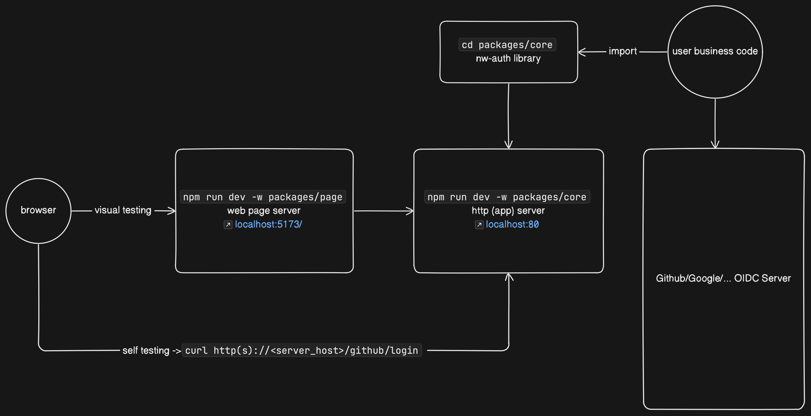
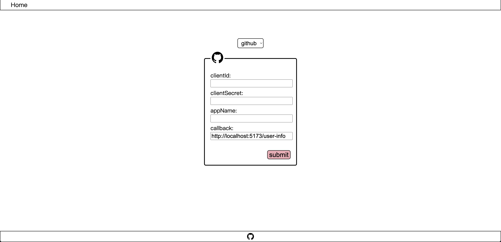

# Node Auth


[](https://github.com/standard/standard)

**[EN](README.md)/[中文](README_CN.md)**

---

A three-party login component developed with the nodeway concept. Its code size is small, the interface is less exposed, and there is no runtime dependency.

The components are designed and developed based on the OIDC authentication process, and can be fully supported whether it is a common [three-party login platform](#support-platform) or a self-deployed OIDC authentication server.

## Usage

```shell
npm i nw-auth
```

**Github Login**

```shell
git clone ... into ${NW-AUTH-HOME}
vim/nano ${NW-AUTH-HOME}/packages/core/example/github.ts
```

```typescript
import http from 'http'

import { GithubOidc } from '../service/github'

export const server = http
 .createServer((req, res) => {
  const reqUrl = req.url as string
  const url = new URL(reqUrl, `https://${req.headers.host as string}`)
  if (url.pathname === '/github/login') {
   const callback = `https://${req.headers.host as string}/github/login`
   const code = url.searchParams.get('code')
   const state = url.searchParams.get('state')
   const oidcService = new GithubOidc('<client_id>', '<client_secret>', callback, '<appName>')
   if (code === null || state === null) {
    oidcService
     .processOidc(callback)
     .then((oidcResp) => {
      if (oidcResp.type === 'redirect') {
       console.info('redirect user to -> ', oidcResp)
       res.writeHead(301, { Location: oidcResp.result as string })
       res.end()
      }
     })
     .catch((err) => {
      console.log(err)
      res.writeHead(500)
      res.end()
     })
   } else {
    console.log('handle user login callback ->', url)
    oidcService
     .processOidc(code, state)
     .then((oidcResp) => {
      if (oidcResp.type === 'userInfo') {
       console.info('request access token successful and get user info ->', oidcResp)
       res.write(JSON.stringify(oidcResp.result))
       res.writeHead(200)
       res.end()
      }
     })
     .catch((error) => {
      res.writeHead(500)
      res.end()
      console.error('backend channel error ->', error)
     })
   }
  }
 })
 .listen(80)

```

**OIDC Process Node Type Declaration**

```typescript

export interface RedirectReq {
    client_id: string;
    redirect_uri: string;
    login?: string;
    scope?: string;
    state?: string;
    allow_signup?: string;
}
export interface CallbackReq {
    code: string;
    state: string;
}
export interface AccessTokenReq {
    client_id: string;
    client_secret: string;
    code: string;
    redirect_uri?: string;
}
export interface AccessTokenReqHeader {
    Accept: 'application/json';
    'User-Agent': string;
    Authorization: 'string';
}
export interface AccessTokenResp {
    access_token: string;
    scope: string;
    token_type: string;
}
export interface UserInfoReqHeader {
    Authorization: string;
    Accept: 'application/json';
}
export interface UserInfoResp {
    login: string;
    id: string;
    node_id: string;
    avatar_url: string;
    gravatar_id: string;
    url: string;
    ...
}

```

## TEST

### Unit Test

```shell
git clone ... into ${NW-AUTH-HOME}
cd ${NW-AUTH-HOME}
npm i
npm run test -w packages/core
```

### Self-deployment Test

It is convenient for developers to confirm the running status of the library, and the component provides a self-deploying web application that provides docking tests of the three-party login platform in the form of docking examples and visual pages.



### Sample Test

```shell
git clone ... into ${NW-AUTH-HOME}
cd ${NW-AUTH-HOME}
npm i
# Default app server -> http://localhost:80
npm run dev -w packages/core
# Run example
curl http(s)://<server_host>/github/login
```

### Visual Test

```shell
git clone ... into ${NW-AUTH-HOME}
cd ${NW-AUTH-HOME}
```

```
.
├──LICENSE
├──package-lock.json
├──package.json
├──.gitignore
├──packages/
│   ├──core/
│   │   ├── ...
│   └──page/
│       ├── ...
└──README.md
```

```shell
# On shell session1 (default app server host port -> http://localhost:80)
npm run dev -w packages/core
# On shell session2 (default page server host port -> http://localhost:5173)
npm run dev -w packages/page
```



## Support-Platform

| Platform                                                                       | Constructor                                             | Type declaration  | Example             |
| ------------------------------------------------------------------------------ | ------------------------------------------------------- | ----------------- | ------------------- |
|     | `WechatOidc<appid,appsecret,redirectUrl>`               | `dto/wechat.d.ts` |                     |
|        | `SinaOidc<clientId,clientSecret,redirectUrl>`           | `dto/sina.d.ts`   | `example/sina.ts`   |
|  | `FeishuOidc<appId,appSecret,appTicket,redirectUrl>`     | `dto/feishu.d.ts` |                     |
|     | `GithubOidc<clientId,clientSecret,redirectUrl,appName>` | `dto/github.d.ts` | `example/github.ts` |
|     | `GoogleOidc<clientId,clientSecret,redirectUrl>`         | `dto/google.d.ts` | `example/google.ts` |
|     | `TwitterOidc<clientId,redirectUrl>`         | `dto/twitter.d.ts` | `example/twitter.ts` |
